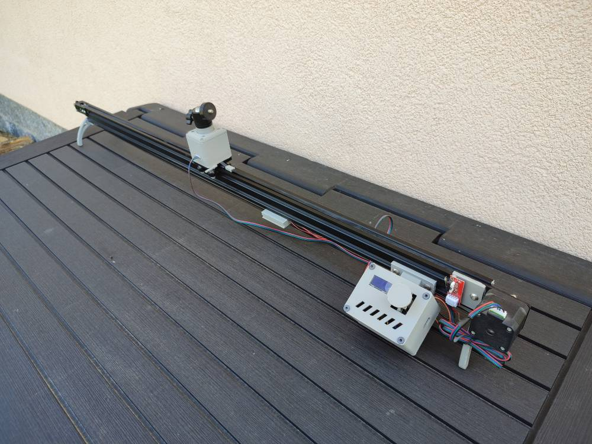

# DIY Motorised CameraSlider with Object Tracking

Component list:

- 2040 Aluminium Extrusion 1000mm
- 2040 V-Slot Gantry
- GT2 Tensioner
- GT2 5mm Pulley
- GT2 Belt
- Nema 17 mounting plate
- 2 x Nema 17 2.5” Stepper Motors 
- Camera Ball Joint Mount
- M5 T Slot Nuts
- M5 Machine Screws
- Arduino Nano 3.0
- CNC shield V4.0
- 2 x A4988 Stepper Motor Drivers
- Endstop RAMPS
- 128×64 I2C OLED Display
- Rotary Pushbutton

